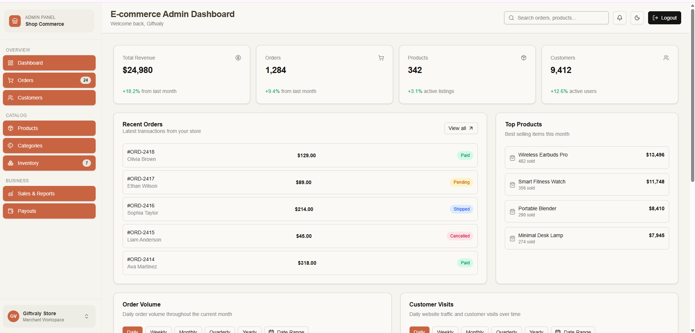

# React Admin Dashboard

A modern, feature-rich admin dashboard built with React 19, TypeScript, and Tailwind CSS. Perfect for e-commerce platforms, SaaS applications, or as a learning project to master contemporary web development practices.



## 🎯 Project Overview

This is a production-ready admin dashboard template featuring:
- **Modern UI/UX**: Clean, professional design with dark mode support
- **Real-time Interactivity**: Responsive components with smooth animations
- **Complete Authentication**: Login/Register/Logout flow with token-based auth
- **Data Visualization**: Interactive charts showing order volumes and customer analytics
- **Mobile Responsive**: Fully functional on desktop, tablet, and mobile devices
- **Type-Safe**: 100% TypeScript for confidence and scalability

Perfect for:
- Learning React 19 + TypeScript + Tailwind CSS ecosystem
- Building e-commerce admin panels
- Creating SaaS dashboards
- Hobby projects and portfolio showcases

## 📊 Tech Stack

### Runtime & Build
- **React 19.2.0** - Modern UI library with new compiler support
- **TypeScript 5.9** - Type-safe JavaScript
- **Vite 7.3.1** - Lightning-fast build tool with HMR

### Styling & UI
- **Tailwind CSS 4.2.0** - Utility-first CSS framework
- **CVA (Class Variance Authority)** - Type-safe component variants
- **Lucide React 0.575.0** - Beautiful icon library
- **Motion 12.34.3** - Smooth animation library

### State Management & Forms
- **Zustand 5.0.11** - Lightweight state management with persistence
- **React Hook Form 7.71.2** - Performant form handling
- **Zod 4.3.6** - TypeScript-first schema validation
- **Axios 1.13.5** - HTTP client with interceptors

### Routing & Navigation
- **React Router 7.13.0** - Client-side routing with data fetching

### Data Visualization
- **Recharts 3.7.0** - Composable charting library built on React

### Development Tools
- **ESLint 9.39.1** - Code quality and consistency
- **Radix UI** - Unstyled, accessible components

## ✨ Key Features

### 🔐 Authentication
- Login/Register pages with form validation
- Token-based authentication with localStorage persistence
- Automatic token refresh and error handling
- Protected routes for authenticated users
- Logout with session cleanup

### 📊 Dashboard
- **KPI Cards**: Real-time metrics (Revenue, Orders, Products, Customers)
- **Order Volume Chart**: Bar chart with 5 time periods (daily, weekly, monthly, quarterly, yearly)
- **Customer Visits Chart**: Analytics with date range filtering
- **Recent Orders Table**: Latest transactions with status indicators
- **Top Products**: Best-selling items with revenue data
- **Inventory Alerts**: Low-stock notifications
- **Quick Actions**: Fast access to common tasks

### 🎨 UI/UX
- **Dark Mode Toggle**: Persisted theme preference with system detection
- **Responsive Navigation**: Mobile drawer sidebar with backdrop
- **Professional Sidebar**: Grouped navigation sections with badges
- **Workspace Menu**: User profile, settings, and logout dropdown
- **Theme System**: CSS variables for consistent branding

### 📱 Mobile Responsiveness
- Adaptive layout for mobile, tablet, and desktop
- Touch-friendly navigation with drawer menus
- Optimized chart sizing for smaller screens
- Fluid typography and spacing

## 📁 Project Structure

```
src/
├── pages/                    # Page components
│   ├── DashboardPage.tsx     # Main dashboard with charts & KPIs
│   ├── Login.tsx             # Authentication UI
│   └── Register.tsx          # User registration
├── components/
│   ├── common/               # Reusable layout components
│   │   ├── Header.tsx        # Top navigation bar
│   │   ├── Sidebar.tsx       # Main navigation with menu
│   │   └── ThemeToggle.tsx   # Dark/light mode switcher
│   ├── dashboard/            # Dashboard-specific components
│   │   ├── OrderVolumeChart.tsx    # Bar chart for orders
│   │   ├── CustomerVisitsChart.tsx # Analytics chart
│   │   └── ChartFilter.tsx         # Period & date range filter
│   └── ui/                   # Primitive UI components
│       ├── button.tsx
│       ├── card.tsx
│       ├── input.tsx
│       ├── form.tsx
│       └── label.tsx
├── layouts/
│   └── DashboardLayout.tsx   # Authenticated app shell
├── store/
│   └── useAuthStore.ts       # Zustand auth state management
├── lib/
│   ├── api.ts                # Axios instance & interceptors
│   ├── config.ts             # Environment configuration
│   ├── utils.ts              # Helper functions
│   └── validation.ts         # Zod schemas for forms
├── App.tsx                   # Main app router
├── main.tsx                  # React entry point
└── index.css                 # Global styles & Tailwind
```

## 🚀 Getting Started

### Prerequisites
- Node.js 18+ or 20+
- pnpm (recommended) or npm/yarn

### Installation

```bash
# Clone the repository
git clone <repository-url>
cd react-admin-dashboard

# Install dependencies
pnpm install
# or
npm install
```

### Quick Start with pnpm

```bash
# 1. Install dependencies (one-time setup)
pnpm install

# 2. Create .env file
echo "VITE_BASE_URL=http://localhost:8000/api" > .env

# 3. Start development server
pnpm dev

# 4. Open in browser
# Navigate to http://localhost:5173
```

**That's it!** Your admin dashboard is now running with live reload enabled.

### Environment Setup

Create a `.env` file in the project root:

```env
VITE_BASE_URL=http://localhost:8000/api
VITE_APP_ENV=development
```

Adjust `VITE_BASE_URL` to match your backend API endpoint.

### Development Server

```bash
# Start dev server with HMR (Hot Module Replacement)
pnpm dev

# Open browser to http://localhost:5173
```

The app will auto-reload on file changes thanks to Vite's HMR. Any changes to `.tsx`, `.ts`, or `.css` files are instantly reflected in the browser without full page refresh.

**Development Commands:**

```bash
# Run development server
pnpm dev              # Main command - starts localhost:5173

# Type-check your code
pnpm build           # Validates TypeScript before building

# Run linter
pnpm lint            # Check code quality with ESLint

# Fix linting issues automatically
pnpm lint --fix      # Auto-fix common issues (if using ESLint extension)
```

### Build for Production

```bash
# Type-check and build optimized bundle
pnpm build

# Output folder: dist/
# File size: ~150-200KB (gzipped)
```

After build, you'll have an optimized bundle ready for deployment:

```bash
# Preview production build locally (before deploying)
pnpm preview

# This starts a local server showing your production build
# Navigate to http://localhost:4173 to preview
```

**Production Build Process:**
1. TypeScript type-checking runs first
2. Vite bundles and minifies all assets
3. Tailwind CSS is purged of unused styles
4. Output goes to `dist/` folder
5. Ready to deploy to Vercel, Netlify, or any static host

### Code Quality

```bash
# Run ESLint
pnpm lint

# Fix linting issues
eslint . --fix
```

### pnpm Tips & Tricks

**Why pnpm?**
- **30-50% faster** than npm (disk space optimization)
- **Stricter dependency management** (prevents phantom dependencies)
- **Monorepo support** (if you scale to multiple packages)

**Useful pnpm Commands:**

```bash
# Add a new package
pnpm add package-name           # Add to dependencies
pnpm add -D package-name        # Add to devDependencies (dev tools)
pnpm add -g package-name        # Add globally

# Remove a package
pnpm remove package-name

# Update packages
pnpm update                     # Update all packages
pnpm update package-name        # Update specific package

# Clear cache
pnpm store prune                # Clean up unused packages
pnpm install --force            # Force reinstall all dependencies

# List installed packages
pnpm list                       # Show dependency tree
pnpm list --depth=0             # Show only top-level packages

# Run scripts from package.json
pnpm run dev                    # Same as pnpm dev
pnpm run build                  # Same as pnpm build
pnpm run lint                   # Same as pnpm lint
```

**Project structure after pnpm install:**
```
node_modules/              # Symlinked packages (not duplicated)
.pnpm/                     # Virtual store (disk space efficient)
pnpm-lock.yaml             # Locked versions (commit to git)
```

## 🔑 Key Concepts & Patterns

### Authentication Flow

1. **Login/Register**: Submit credentials via form
2. **Token Storage**: Keep JWT in localStorage via Zustand
3. **API Interceptor**: Auto-inject token in request headers
4. **Error Handling**: 401 redirects to login automatically
5. **Logout**: Clear token and redirect

**Code Reference**: [useAuthStore.ts](src/store/useAuthStore.ts)

### State Management

Using **Zustand** with persist middleware:
- Global auth state (user, token, permissions)
- Automatic localStorage sync
- Simple API: `useAuthStore((state) => state.field)`

**Code Reference**: [useAuthStore.ts](src/store/useAuthStore.ts)

### Form Handling

React Hook Form + Zod for validation:
- Declarative error handling
- Minimal re-renders
- Type-safe form data
- Custom validation schemas

**Code Reference**: [validation.ts](src/lib/validation.ts)

### Responsive Design

Tailwind breakpoints:
- `sm`: 640px (mobile landscape)
- `md`: 768px (tablet)
- `lg`: 1024px (desktop)
- `xl`: 1280px (wide screens)

Mobile-first approach: base styles apply to mobile, add `md:`, `lg:` prefixes for larger screens.

### Dark Mode

CSS variables + `dark` class strategy:
```css
/* Light mode (default) */
--primary: 0 84% 60%
--background: 0 0% 100%

/* Dark mode (.dark class) */
.dark {
  --primary: 0 84% 60%
  --background: 0 0% 5%
}
```

Toggle button saves preference to localStorage and applies class to document root.

## 📈 Chart Integration

Charts use **Recharts** with 5-period aggregation:

1. **Daily**: Raw data from past 30 days
2. **Weekly**: Summed by week
3. **Monthly**: Summed by month
4. **Quarterly**: Summed by quarter
5. **Yearly**: Annual totals

**Features**:
- Date range picker for custom periods
- Theme-aware colors using CSS variables
- Responsive sizing with `ResponsiveContainer`
- Interactive tooltips
- Bar charts with value labels on hover

**Code Reference**: 
- [OrderVolumeChart.tsx](src/components/dashboard/OrderVolumeChart.tsx)
- [CustomerVisitsChart.tsx](src/components/dashboard/CustomerVisitsChart.tsx)

## 🔄 Component Lifecycle

```
App.tsx (Router)
  ↓
AuthGuard (Check token)
  ├─ Authenticated → DashboardLayout
  │   ├─ Header (logo, search, theme toggle, logout)
  │   ├─ Sidebar (navigation menu)
  │   └─ Outlet (routing)
  │       └─ DashboardPage (charts, KPIs, tables)
  │
  └─ Not Authenticated → Login/Register
```

## 🎓 Learning Resources

This project teaches:

- **React 19 fundamentals**: Components, hooks, state
- **TypeScript patterns**: Generics, types, interfaces
- **Form handling**: Validation, error states, submission
- **State management**: Zustand patterns, persistence
- **Routing**: Protected routes, navigation patterns
- **Styling**: Tailwind utilities, dark mode, responsive design
- **API integration**: Interceptors, error handling, auth
- **Data visualization**: Chart composition and interactivity

### Next Steps to Learn

1. **API Integration**: Connect charts to real backend endpoints
2. **User Profile**: Build a profile page from auth store data
3. **Settings Page**: Implement preference and configuration UI
4. **Real-time Updates**: Add WebSocket for live data
5. **Testing**: Add vitest and @testing-library/react
6. **Performance**: Implement code splitting and lazy loading

## 🛠 Development Workflow

### Creating a New Page

1. Create in `src/pages/NewPage.tsx`
2. Add route to `App.tsx`
3. Wire navigation in `Sidebar.tsx`

### Adding a New Component

1. Create in `src/components/feature/Component.tsx`
2. Use existing UI primitives from `src/components/ui/`
3. Apply Tailwind classes and CSS variables

### Updating State

1. Add action to `useAuthStore` or create new store
2. Use hook in component: `const { field, action } = useAuthStore()`
3. Call action on event handler

### Adding a Chart

1. Create new file in `src/components/dashboard/`
2. Import Recharts components
3. Use `ChartFilter` for period selection
4. Connect to data API endpoint

## 📝 Documentation Files

- **[AI_AGENT.md](AI_AGENT.md)** - For AI assistants working on this project
- **[DEVELOPER_GUIDE.md](DEVELOPER_GUIDE.md)** - Comprehensive developer roadmap

## 🎨 Customization

### Change Primary Color

Edit `src/index.css`:
```css
:root {
  --primary: 0 84% 60%; /* Change to your brand color */
}
```

### Modify Sidebar Navigation

Edit `src/components/dashboard/Sidebar.tsx`:
```tsx
const navSections = [
  {
    title: "Your Section",
    items: [
      { label: "Item", href: "/path", icon: IconComponent }
    ]
  }
]
```

### Update Chart Data

Replace mock data in chart components with API calls:
```tsx
useEffect(() => {
  api.get('/orders/daily').then(res => setData(res.data))
}, [period])
```

## 🐛 Troubleshooting

### Token Expiration Issues
- Check `VITE_BASE_URL` is correct
- Verify token in localStorage (`auth-storage` key)
- Check API interceptor in [api.ts](src/lib/api.ts)

### Chart Not Rendering
- Ensure `ResponsiveContainer` is in parent flex/grid context
- Check browser console for data errors
- Verify comma separators in mock data objects

### Theme Not Persisting
- Check localStorage is enabled
- Verify `dark` class is on `document.documentElement`
- Test in different browser to rule out storage issues

### Mobile Sidebar Not Working
- Ensure viewport meta tag in index.html
- Check z-index stacking context (sidebar: z-40, backdrop: z-30)
- Test touchscreen close on actual mobile device

## 📱 Browser Support

- Chrome/Edge: Latest 2 versions
- Firefox: Latest 2 versions
- Safari: Latest 2 versions
- Mobile browsers: iOS Safari 12+, Chrome Android latest

## 🤝 Contributing

This is a hobby project! Improvements welcome:

1. Fork the repository
2. Create feature branch: `git checkout -b feature/amazing-feature`
3. Commit changes: `git commit -m 'Add amazing feature'`
4. Push to branch: `git push origin feature/amazing-feature`
5. Open Pull Request

## 📝 License

MIT - Feel free to use this project for personal, educational, or commercial purposes.

## 🙋 Support & Questions

For questions or issues:
1. Check existing documentation files
2. Review similar implementations in codebase
3. Check Recharts/Tailwind documentation
4. Search GitHub issues

## 🚀 Future Enhancements

Planned features for future versions:
- [ ] Real API integration with mock server
- [ ] User profile and settings pages
- [ ] Permission-based route access control
- [ ] Export data to CSV/PDF
- [ ] Real-time notifications with WebSocket
- [ ] Advanced filtering and search
- [ ] Performance metrics and analytics
- [ ] Unit and integration tests
- [ ] Storybook for component playground
- [ ] GitHub Actions CI/CD pipeline

---

**Happy coding! 🎉** This project is designed to be learned from and extended. Feel free to experiment, break things, and rebuild better!
